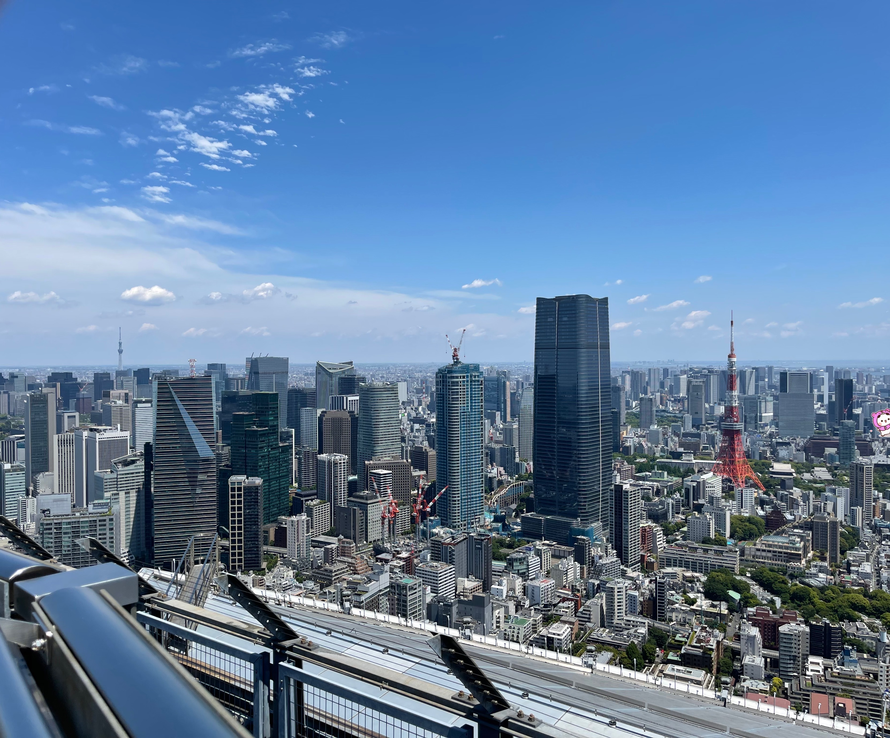
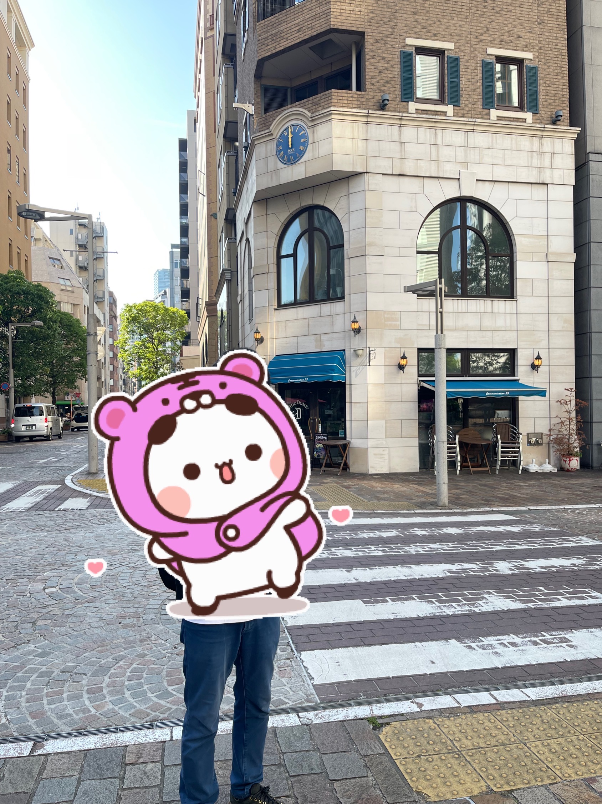

# 2023年5月16日(火) 聖地巡礼 Day 2
<p align="center">
  <a href="https://example.com/">
    
  </a>

  <h3 align="center">聖地巡礼 Day 2</h3>

  <p align="center">
    东京巨蛋 ➡️ 乃木坂 ➡️ 六本木 ➡️ 乃木坂 ➡️ 秋葉原 ➡️ 大手町 ➡️ 汐留 ➡️ 日向坂 ➡️ 银座
    <br>
    <a href="https://reponame/issues/new?template=bug.md">Report bug</a>
    ·
    <a href="https://reponame/issues/new?template=feature.md&labels=feature">Request feature</a>
  </p>
</p>


## Table of contents

- [今日路线](#今日路线)
- [Status](#status)
- [What's included](#whats-included)
- [巡礼一日流程](#巡礼一日流程)
- [Bugs and feature requests](#bugs-and-feature-requests)
- [Contributing](#contributing)
- [Creators](#creators)
- [Thanks](#thanks)
- [Copyright and license](#copyright-and-license)


## 今日路线

- 东蛋
- 乃木坂
- 六本木
- 乃木坂again
- 秋葉原
- 大手町
- 汐留
- 日向坂
- 银座

## Status

0. 心情
   1. 明天要live了，昨天高强度特种兵巡礼，今天本来安排得并不多，心情已经飞到明天见飛鳥了
   2. 然而今天的强度比昨天有过之无不及
   3. 今天主打的正好全部都是 MV 的拍摄地，exciting！
   4. 心里想着什么都新鲜
   5. 心里鼓励自己社牛一点不要怕
   6. 完成任务就ok！
1. 巡礼
   1. 明天要很早去场贩，今天先模拟一下去东蛋的路线，感觉一下时间（结果就是连续三天从飯田橋駅走到东蛋，闭着眼睛走都能走到）
   2. 去乃木坂，走路去森
   3. 顺便逛一下看一眼六本木Hills
   4. 回到乃木坂，就为了一日券进站打卡
   5. 秋葉原本来想多逛一会儿的，不过时间有限+天好热+人超多+偶遇警察抓人，混乱的一笔
   6. 秋葉原找到Isee，赶紧撤了
   7. 大手町好像是个金融区，大家都是日剧里面的上班族。应该没有游客会来吧
   8. 找路人拍照半天等不来一个路人，急
   9. 大手町出发居然不是メトロ，一日票不能用了
   10. 汐留走了好一会儿，路上全是下班的人和初中生，看来又来到一个生活区
   11. 日向坂等了好久才等到一个大叔帮我拍照
   12. 大叔听我日语说“有一个叫Hinatazaka46的女性偶像组合，大饭跌斯”之后，笑了笑说“可是这个念Hyugazaka哦”，我笑了笑说知道，也不知道敬语用的对不对，支支吾吾阿巴阿巴地准备拍照了
   13. 拍照前跟大叔说自己准备手里拿根棒子，大叔笑笑
   14. 我拍照的时候莫名其妙路人多出来了，看到我这种偶像厨也是见怪不怪了
   15. 本来想去就近的慶應義塾大学看看的，不过时间不早了手机也快没电了，銀座还没去呢，所以下次再说吧
   16. 銀座的インフルエンサー和無印良品其实都没有找到我要找的
   17. 銀座吃个饭，早点回去休息，明天场贩+live才是重头戏
   
## What's included

```text
日本首行_齋藤飛鳥卒コン/Day2
├── README.md
└── img
    ├── イタリア街
    │   ├── IMG_7520.JPG
    │   ├── IMG_7521.JPG
    │   └── IMG_7623.JPG
    ├── 东蛋
    │   ├── IMG_7474.JPG
    │   ├── IMG_7475.JPG
    │   ├── IMG_7476.JPG
    │   └── IMG_7477.JPG
    ├── 乃木坂
    │   ├── IMG_7478.JPG
    │   ├── IMG_7479.JPG
    │   ├── IMG_7480.JPG
    │   ├── IMG_7481.JPG
    │   ├── IMG_7482.JPG
    │   └── IMG_7483.JPG
    ├── 乃木坂5号口
    │   ├── IMG_7510.JPG
    │   ├── IMG_7511.JPG
    │   ├── IMG_7512.JPG
    │   └── IMG_7513.JPG
    ├── 大手町
    │   ├── IMG_7517.JPG
    │   ├── IMG_7518.JPG
    │   ├── 夜明けまで強がらなくてもいい1.png
    │   ├── 夜明けまで強がらなくてもいい2.png
    │   ├── 夜明けまで強がらなくてもいい3.png
    │   ├── 夜明けまで強がらなくてもいい4.png
    │   ├── 夜明けまで強がらなくてもいい5.png
    │   └── 夜明けまで強がらなくてもいい6.png
    ├── 日向坂
    │   ├── IMG_7522.JPG
    │   ├── IMG_7523.JPG
    │   ├── IMG_7524.JPG
    │   └── IMG_7529.JPG
    ├── 森
    │   ├── IMG_7484.JPG
    │   ├── IMG_7485.JPG
    │   ├── IMG_7486.JPG
    │   ├── IMG_7487.JPG
    │   ├── IMG_7488.JPG
    │   ├── IMG_7489.JPG
    │   ├── IMG_7490.JPG
    │   ├── IMG_7491.JPG
    │   ├── IMG_7492.JPG
    │   ├── IMG_7493.JPG
    │   ├── IMG_7494.JPG
    │   ├── IMG_7495.JPG
    │   ├── IMG_7496.JPG
    │   ├── IMG_7497.JPG
    │   ├── IMG_7498.JPG
    │   ├── IMG_7499.JPG
    │   ├── IMG_7500.JPG
    │   ├── 森台阶1.JPG
    │   ├── 森台阶2.JPG
    │   ├── 森台阶3.JPG
    │   ├── 森台阶4.JPG
    │   ├── 森台阶后1.JPG
    │   ├── 森台阶后2.JPG
    │   ├── 森台阶后3.JPG
    │   ├── 森台阶后4.JPG
    │   ├── 森楼顶1.png
    │   ├── 森楼顶2.png
    │   ├── 森楼顶3.png
    │   ├── 森楼顶4.png
    │   └── 森楼顶5.png
    ├── 欅坂櫻坂
    │   ├── IMG_7501.JPG
    │   ├── IMG_7502.JPG
    │   ├── IMG_7503.JPG
    │   ├── IMG_7504.JPG
    │   ├── IMG_7505.JPG
    │   ├── IMG_7506.JPG
    │   ├── IMG_7507.JPG
    │   ├── IMG_7508.JPG
    │   └── IMG_7509.JPG
    ├── 秋葉原UDX
    │   ├── IMG_7514.JPG
    │   ├── IMG_7515.JPG
    │   ├── IMG_7516.JPG
    │   └── IseeUDX.png
    ├── 銀座
    │   ├── IMG_7525.JPG
    │   ├── IMG_7526.JPG
    │   ├── IMG_7527.JPG
    │   ├── IMG_7528.JPG
    │   ├── IMG_7530.JPG
    │   ├── IMG_7531.JPG
    │   ├── IMG_7554.JPG
    │   ├── IMG_7555.JPG
    │   ├── インフルエンサー1.png
    │   └── インフルエンサー2.png
    └── 銀座蟹道樂
        ├── IMG_7532.JPG
        ├── IMG_7533.JPG
        ├── IMG_7534.JPG
        ├── IMG_7535.JPG
        ├── IMG_7536.JPG
        ├── IMG_7537.JPG
        ├── IMG_7538.JPG
        ├── IMG_7539.JPG
        ├── IMG_7540.JPG
        ├── IMG_7541.JPG
        ├── IMG_7542.JPG
        ├── IMG_7543.JPG
        ├── IMG_7544.JPG
        ├── IMG_7545.JPG
        ├── IMG_7546.JPG
        ├── IMG_7547.JPG
        ├── IMG_7548.JPG
        ├── IMG_7549.JPG
        ├── IMG_7550.JPG
        ├── IMG_7551.JPG
        ├── IMG_7552.JPG
        └── IMG_7553.JPG
```

## 巡礼一日流程
### 东京巨蛋

- #### 东蛋

虽然明天后天都要来，可是忍不住提前去踩个点。去的比较早，没有看到任何乃木坂元素。

这几个地方明后两天每一寸土地上都是人山人海。

| 飯田橋駅<br/>走到东蛋22号门<br/>最近的一个小道           | 激动的心颤抖的手          | 东蛋第一张                         | 22号入口<br/>对面就是明天场贩的地方        |
|-------------------------------|-------------------|-------------------------------|------------------------------|
|  |  |  |  |

因为没啥看的，立刻从另一边过天桥出发，前往乃木坂，准备第二次用東京メトロ的一日票，印上乃木坂站。


### 乃木坂

- #### 乃木坂駅到乃木坂陸橋

虽然昨天刚来过，不过每次过来根本忍不住拍照的手👋

因为今天后面的日程极度繁忙，手机随时会没电，所以没有过多逗留，没有进入乃木神社（明后两天东蛋live后，周五再去），快速顺路拍了几张。

- #### 乃木坂駅inside

| 飛鳥海报                           | 特蕾莎生日海报                        |
|--------------------------------|--------------------------------|
|  |  |

- #### 乃木坂駅outside

| 乃木坂駅1号口                        | 乃木坂柱子1                         | 乃木坂柱子2                         | 乃木坂陸橋                          
|--------------------------------|--------------------------------|--------------------------------|--------------------------------|
|  |  |  |  |


### 六本木

从乃木坂1号口步行到六本木（也是蛮勇的，这么大太阳；东京这几天不是像昨天一样下雨就是像今天这样暴晒）

- #### 森美術館

上楼流程（要买两次票）

| 坐标                                       | 没有计划地看见了欅坂和テレビ朝日😄<br/><br/>看到这个牌子基本就快到了 | 原地一转身就看到森美術館的箭头              | 沿着箭头走一会儿就看到了                 |
|------------------------------------------|-------------------------------------|------------------------------|------------------------------|
| 森美術館<br/><br/>附近突然出现很多看起来有钱的上班族，那么差不多就到了 |         |  |  |

| 坐标                                  | 我们偶像厨要去的其实不是森美術館本身<br/>而是55楼的 Sky Deck | 森美術館门口                       | 森美術館箭头上去<br/><br/>我那天有两个队伍，好像我前面的人都是在排迪士尼的不知道什么活动。<br/>士大夫看到我就唯一一个男生排在一群女生当中又一副不是很确定的样子就来帮我，<br/>听我说要去的是 Sky Deck 马上带我去前面不用排队的其实。 |
|-------------------------------------|----------------------------------------|------------------------------|-----------------------------------------------------------------------------------------------------------------------------------|
| 森美術館|            |  |                                                                                                       |

| 坐标 | 跟柜台的工作人员买票其实买的是52楼一个不知道什么展的票子。<br/>上到52楼以后绕一圈走到一个大厅，<br/>往左是去Sky Deck存包的地方和电梯，<br/>往前是真正去森美術館的检票口，我们偶像厨往左走。<br/>大厅中央的士大夫听我阿巴阿巴的日语说要去 Sky Deck，就日英混杂地跟我说要先在前面机器买上去SkyDeck的票子。<br/>去机器那边根本没人管我，有一点点手忙脚乱不过根本没人排队，没看到西瓜卡就用信用卡支付了，也就几块钱美金。 | 买完 Sky Deck 的票，电梯门口的士大夫姐姐早就等不及了（人太少，难得又来一个冤大头），一路指导我去存包的地方。<br/>（注意⚠️）还好我看了攻略事先准备好了100円的硬币用来存包。<br/>我甚至傻到没找到投币口还是士大夫教的我。<br/>存完包，身上只有手机，然后士大夫又一路带我上电梯、按下顶楼的按钮、她退出电梯、90度鞠躬直到电梯门合上。 | 电梯门开，走过一段钢铁走廊和小阶梯，<br/>一路上保安大小哥们一直打招呼<br/>并不妨碍我已经全程开始录视频了的。<br/>楼梯走上去的尽头还有保安大哥欢迎，<br/>踏上顶楼第一眼是这样的： |
|-------------------------------------|---------------------------------------------------------------------------------------------------------------------------------------------------------------------------------------------------------------------------------------|-----------------------------------------------------------------------------------------------------------------------------------------------------------------------------------|----------------------------------------------------------------------------------------------------|
| 森美術館|                                                                                                                                                                                                           |                                                                                                                                                       |                                                                        |

- #### ここにはないもの楼顶

| 坐标            | 巡礼1                          | 巡礼2                          | Description 1            | Description 2            |
|---------------|------------------------------|------------------------------|--------------------------|--------------------------|
| 森美術館<br/><br/>52楼出发到55楼 |  |  |  |  |


| 坐标            | 巡礼3                                                     | 巡礼4 | 巡礼5                          | Description              |
|---------------|----------------------------------------------------------|-------------------|------------------------------|--------------------------|
| 森美術館<br/><br/>52楼出发到55楼 | | |  |  |

| 坐标            | 巡礼6                                                                                 | 巡礼7      | 站在上面的感觉大概是这样的                                                           | Description              |
|---------------|-------------------------------------------------------------------------------------|---------------------|-------------------------------------------------------------------------|--------------------------|
| 森美術館<br/><br/>52楼出发到55楼 |   |  |  |  |

| 坐标            | 巡礼8                       | 巡礼9                       | 巡礼10                      | Description                                                |
|---------------|---------------------------|---------------------------|---------------------------|------------------------------------------------------------|
| 森美術館<br/><br/>52楼出发到55楼 |  |  |  |  |


- #### 森美術館miscellaneous

| 坐标       | 走之前快速看一下毕竟买了票的52楼的展<br/>     | 居然看到了2010世博会的毛绒绒英国馆                       | 时间紧张，所以按计划在52楼这个展的出口的一家西餐厅随便吃了一顿当午饭了，体力倒是恢复得不错 |
|----------|------------------------------|------------------------------|------------------------------------------------|
| 森美術館 52楼 |  | |                    |


### 欅坂櫻坂
- #### 欅坂
| 坐标     | 从森美術館礼品店一出来，就会到一个商场的入口，<br/>看这两个牌子  |           跟着牌子走               | 出来到马路上就算到欅坂了 （这个1F）             |
|--------|------------------------------------|----------------------------|---------------------------------|
| 森美術館下来 | | |  |

- #### 櫻坂
| 坐标     | 看路牌，<br/>此时我站在欅坂                  | 沿着櫻坂走，其实是一片住宅区，感觉走到了别人小区和家里，挺温馨。<br/>没有多拍，无非是普通的马路+树荫+嬉戏的小孩+看孩子的妈妈们<br/>走到头是蔦屋書店 |
|--------|---------------------------------|----------------------------------------------------------------------------------|
| 欅坂旁边就是 |  |                                                   |

- #### 欅坂miscellaneous
从櫻坂出来沿着欅坂往回走

这一片其实都算六本木hills

| 老日剧人了<br/>久闻大名 tv asahi         | 反过来沿着欅坂走，回到森美術館方向               | 到处欅坂                              | 欅坂studio                        |
|---------------------------------|---------------------------------|---------------------------------|---------------------------------|
|  |  |  |  |


### 乃木坂again

- #### 乃木坂5号口

| 坐标                                                   | 5号口1                              | 5号口2                              | 进之前翻出我的一日券准备纪念打卡，<br/>顺便自動販売機买了一瓶ポカリスエット喝得爽爽的 | 入口最近的是女生车厢，男同学们注意别社死😳<br/>我在这个位置等车呆了好一会儿，<br/>一低头才发现标记，赶紧逃走了，幸好周围没人 |
|------------------------------------------------------|-----------------------------------|-----------------------------------|-----------------------------------------------|----------------------------------------------------------------------|
| 走到国立新美術館一个不知道什么门（反正不是昨天那个正门），<br/>跟保安大哥日语问路，往前走几步就到了 |  |  |              |                                     |


### 秋葉原

- #### 奔跑爱喜

| 坐标                                                  | 巡礼1                               | 巡礼2                              | 巡礼3                               | Description                       |
|-----------------------------------------------------|-----------------------------------|----------------------------------|-----------------------------------|-----------------------------------|
| (35.700626, 139.772909) |  |  |  |  |


### 大手町

- #### 夜明けまで強がらなくてもいい台阶
| 坐标                                                  | 巡礼1                            | 巡礼2                            | Description 1                                                                       | Description 2                                                                       |
|-----------------------------------------------------|--------------------------------|--------------------------------|-------------------------------------------------------------------------------------|-------------------------------------------------------------------------------------|
| 大手町ファーストスクエア前タクシー乗り場 |  |  |  |  |


### 汐留イタリア街

坐都营地铁来的，进入生活区、工作区

- #### シンクロニシティ花白鸽

| 坐标                                    | 巡礼1                              | 巡礼2                              | Description                      |
|---------------------------------------|----------------------------------|----------------------------------|----------------------------------|
| (35.661124, 139.757423) |  |  |  |


### 日向坂

从イタリア街出来，身边都是初中生放学和家庭主妇。

走到一个高架下面进入一个巨大的地铁站，迷路了一下，手机也快没电了，凭感觉找到了对的地铁线😭，快日落了到达二之橋，过去几步就是日向坂。

- #### 日向坂
| 坐标                                                | 巡礼1: <br/>偷偷抓着一根QQQ棒子合影                                                            | 巡礼2                            | 巡礼3                            | 巡礼4                            |
|---------------------------------------------------|-------------------------------------------------------------------------------|--------------------------------|--------------------------------|--------------------------------|
| (35.652553, 139.737324) |  |  |  |  |


### 銀座

- #### インフルエンサー

来銀座的唯一目的，就是找到我个人最喜欢，也是对我个人有特殊意义的一首歌的 MV 拍摄地。

可惜，又是物是人非，店变成一个私人会所了。而且当天还有活动被不知道谁包了场，一群夜店小哥拦着不让进。

我不甘心，还跟夜店小哥们聊了一下这个地方以前是不是叫KIRIKO，可是没一个小哥知道，聊了个寂寞。。。

| 坐标          | 巡礼1: 原来的 KIRIKO LOUNGE 变成这个叫 RAISE 的貌似是个私人会所。<br/>旁边的ZUKAN MUSEUM根本黑漆漆的完全没开门的样子。 | 巡礼2: 銀座地铁口一出来就是東急             | Description1                   | Description2                   |
|-------------|----------------------------------------------------------------------------------|-------------------------------|--------------------------------|--------------------------------|
| 東急プラザ 銀座 6F |                                                     |  |  |  |

- #### 久保史緒里無印良品塩キャラメルナッツ

也不能白跑一次，所以索性就准备在銀座随便逛逛，解决晚饭，早点回去准备明天飛鳥的演唱会。（结果并没有早回去😅）

可惜，ten推荐的冰淇淋居然没有了。。。所以说銀座两个巡礼都没巡到😭

| 坐标              | 找找ten推荐的冰淇淋，顺便銀座的無印良品浅浅地买买买一下。 | 结果，偶像厨真可怕。<br/>我跑去问正在往货架上放货的小姐姐，她带我去冰柜，然后发觉居然就ten推荐的这个口味売り切れ。。<br/>热心的小姐姐赶紧拿出ipad帮我查看附近哪里有货发觉都没了，不过我也不可能特地为个冰淇淋跑老远吧😂<br/>不管怎么样，还是很谢谢她帮我找。 | 可怜的我随便买了一个解解馋               | 好吃还是挺好吃的<br/>（里面没有勺子，但是结账的地方可以自己随便拿） |
|-----------------|--------------------------------|---------------------------------------------------------------------------------------------------------------------------------------|-----------------------------|--------------------------------------|
| 無印良品 銀座 |   |                                                                                                          |  |         |

- #### 銀座蟹道樂

买完無印良品，天色已经暗了，我怕吃饭要排队就赶紧先去吃了，结果并不用排队没啥人😂

其实本来考虑去吃新橋的かに地獄的，不过一个是因为走过去有一点点小距离，另外自己这个阿巴阿巴的日语估计连螃蟹都挑不来，加上自己又有点饿了，就就近吃蟹道樂了。

| 坐标         | 菜单1                                | 菜单2: 我看价格随便选了季节限定的木蓮。<br/>点菜时候问了老板娘两个木蓮什么区别，<br/>说了半天一知半解反正就是三种蟹这个是季节限定的另一个all-seasons都有 | 菜单3: 感觉一个套餐必然吃不饱，所以加了一份蟹腿盖饭（本人骨骼惊奇） |
|------------|------------------------------------|------------------------------------------------------------------------------------------|-------------------------------------|
| かに道楽銀座八丁目店 |  |                                                          |     |

| 坐标         | 随便拍拍1                            | 随便拍拍2                            | 木蓮的每一道菜                                                                                                    |一个一个上直到甜品                |
|------------|----------------------------------|----------------------------------|------------------------------------------------------------------------------------------------------------|---------|
| かに道楽銀座八丁目店 |  |  | <br/> |<br/> |

| 坐标         | 随便拍拍3                            | 随便拍拍4                            | 随便拍拍5                            | 
|------------|----------------------------------|----------------------------------|----------------------------------|
| かに道楽銀座八丁目店 |  |  |  |


| 坐标         | 随便拍拍6                            | 随便拍拍7                            | 
|------------|----------------------------------|----------------------------------|
| かに道楽銀座八丁目店 |  |  |

| 坐标         | 随便拍拍8                           | 随便拍拍9                            |
|------------|---------------------------------|----------------------------------|
| かに道楽銀座八丁目店|  |  |

| 坐标                                         | 随便拍拍10                           | 随便拍拍11                           | 随便拍拍12                           |
|--------------------------------------------|----------------------------------|----------------------------------|----------------------------------|
| かに道楽銀座八丁目店 |  |  |  |

| 坐标                                         | 随便拍拍10                           | 随便拍拍11                           |
|--------------------------------------------|----------------------------------|----------------------------------|
| かに道楽銀座八丁目店 |  |  |


- #### 銀座miscellaneous
吃完出来本来准备再逛逛的，可惜好多店都关门了，所以稍微从八丁目走到二丁目，随便看看就找地铁口往回走了。

手机也没电了，回宾馆的路线提前记在了脑子里，所幸最终无事。

| 坐标         | Apple Store的临时店开到了八丁目<br/>真正的本店围起来了告示说在装修 | Tiffany旁边，夹在一群大牌中间的銀座伊東屋<br/>本来想去买点东西的，也关门了，太晚啦 |
|------------|-------------------------------------------|-------------------------------------------------|
| 銀座 |              |                    |


## Bugs and feature requests

Have a bug or a feature request? Please first read the [issue guidelines](https://reponame/blob/master/CONTRIBUTING.md) and search for existing and closed issues. If your problem or idea is not addressed yet, [please open a new issue](https://reponame/issues/new).

## Contributing

Please read through our [contributing guidelines](https://reponame/blob/master/CONTRIBUTING.md). Included are directions for opening issues, coding standards, and notes on development.

Moreover, all HTML and CSS should conform to the [Code Guide](https://github.com/mdo/code-guide), maintained by [Main author](https://github.com/Darienzhangyy).

Editor preferences are available in the [editor config](https://reponame/blob/master/.editorconfig) for easy use in common text editors. Read more and download plugins at <https://editorconfig.org/>.

## Creators

**Creator 1**

- <https://github.com/Darienzhangyy>

## Thanks

感谢一路上随机抓的陌生路人帮我拍的照。

## Copyright and license

Code and documentation copyright 2011-2023 the authors. Code released under the [MIT License](https://reponame/blob/master/LICENSE).
