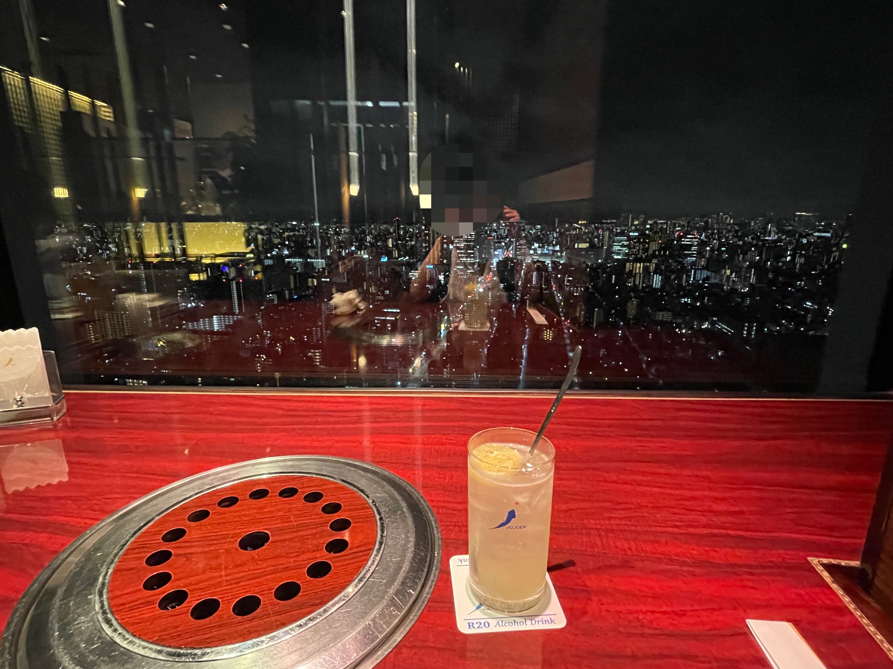

# 2023年5月19日(金) 聖地巡礼 Day 3
<p align="center">
  <a href="https://example.com/">
    
  </a>

  <h3 align="center">聖地巡礼 Day 3</h3>

  <p align="center">
    乃木坂 ➡️ 渋谷 ➡️ 恵比寿 ➡️ 谷中銀座 ➡️ Sky Tree ➡️ 渋谷
    <br>
    <a href="https://reponame/issues/new?template=bug.md">Report bug</a>
    ·
    <a href="https://reponame/issues/new?template=feature.md&labels=feature">Request feature</a>
  </p>
</p>


## Table of contents

- [今日路线](#今日路线)
- [Status](#status)
- [What's included](#whats-included)
- [巡礼一日流程](#巡礼一日流程)
- [Bugs and feature requests](#bugs-and-feature-requests)
- [Contributing](#contributing)
- [Creators](#creators)
- [Thanks](#thanks)
- [Copyright and license](#copyright-and-license)


## 今日路线

- 乃木坂
- 渋谷
- 恵比寿
- 谷中銀座
- Sky Tree
- 渋谷 again

## Status

1. 心情
   1. 昨天跟飛鳥告别，心情还在一种微妙的状态
   2. 如果一个人闷在家里，估计会艺谋
   3. 可是出门见到这么多偶像厨在乃木神社挤来挤去，心里居然有一丝安慰
   4. 今天计划好的巡礼计划还是要高质量完成（特种兵）
   5. 到恵比寿的时候，已经是倾盆大雨，事后发现我背着的书包居然在滴水
   6. 一种马上要去见白麻、鸽子、老桥、飛鳥、美月、友达、小樱的错觉，exciting！
   7. 一边亦可赛艇，一边难过。。。地暴走在暴雨天的东京街头
2. 巡礼
   1. 一路上，我把所有路过的 711 和 Lawson 便利店里面的日刊sports都收了，不过也就收到6、7份吧。（上面有昨天飛鳥live的整版新闻）
   2. 乃木坂永远是我的出发站，因为一日券要打卡纪念
   3. 涩谷一来是跟好久不见的日本朋友吃饭，二来是周一没去成的 PARCO 趁着雨势不大赶紧拍照
   4. 恵比寿两个地方有点冷门而且一路上暴雨，正好洗鞋子洗书包了x
   5. 恵比寿其实还有好几个巡礼点雨太大就不去了，比如猴莉的便利店、鸽子的扶梯等，下次再来
   6. 期待谷中銀座，坐在小樱坐过的同一个椅子上吃冰淇淋和肉饼
   7. 谷中銀座商店街其实很短，看小樱散步我还以为很热闹的大马路呢😆
   8. 期待找到老桥的地方: 谷中銀座附近的居民区，破破的理发店居酒屋，浓浓的烟火气和生活气息。加上下雨天给空气中带来一股神奇的气息，形容不来，一定要说的话，“温蕴”这个词具像化了。 
   9. 偶遇一个父亲跨上家门口的自行车出门，女儿探出头问爸爸什么时候回来: 感觉自己走在日剧/日影里面。
   10. 一个人不嫌远地去sky Tree吃乃团必备叙々苑，正好看看夜景也是美滋滋
   11. 10点前从sky tree赶到渋谷，火速扫光架子上20单以前的初回+日向初回

## What's included

```text
日本首行_齋藤飛鳥卒コン/Day5
├── README.md
└── img
    ├── SkyTree
    │   ├── IMG_7425.JPG
    │   ├── IMG_7426.JPG
    │   ├── IMG_7427.JPG
    │   ├── IMG_7428.JPG
    │   ├── IMG_7429.JPG
    │   ├── IMG_7430.JPG
    │   ├── IMG_7431.JPG
    │   └── IMG_7432.JPG
    ├── 乃木坂
    │   ├── IMG_7396.JPG
    │   ├── IMG_7397.JPG
    │   ├── IMG_7398.JPG
    │   ├── IMG_7399.JPG
    │   ├── IMG_7400.JPG
    │   ├── IMG_7401.JPG
    │   └── IMG_7402.JPG
    ├── 恵比寿
    │   ├── IMG_7412.JPG
    │   ├── IMG_7413.JPG
    │   ├── ロマンスのスタート白麻.png
    │   └── ロマンスのスタート鸽子.png
    ├── 渋谷
    │   ├── IMG_7403.jpg
    │   ├── IMG_7404.JPG
    │   ├── IMG_7405.JPG
    │   ├── IMG_7406.JPG
    │   ├── IMG_7407.JPG
    │   ├── IMG_7408.JPG
    │   ├── IMG_7409.JPG
    │   ├── IMG_7410.JPG
    │   ├── IMG_7411.JPG
    │   ├── IMG_7459.JPG
    │   ├── 僕僕parco楼下.png
    │   ├── 僕僕parco楼顶.png
    │   ├── 僕僕parco楼顶顶.png
    │   └── 僕僕parco电梯.png
    ├── 渋谷again
    │   ├── IMG_7433.JPG
    │   ├── IMG_7434.jpg
    │   ├── IMG_7435.JPG
    │   ├── IMG_7436.JPG
    │   ├── IMG_7437.JPG
    │   └── IMG_7438.JPG
    └── 谷中銀座
        ├── IMG_7414.JPG
        ├── IMG_7415.JPG
        ├── IMG_7416.JPG
        ├── IMG_7417.JPG
        ├── IMG_7418.JPG
        ├── IMG_7419.JPG
        ├── IMG_7420.JPG
        ├── IMG_7421.JPG
        ├── IMG_7422.JPG
        ├── IMG_7424.JPG
        ├── 小樱冰淇淋.png
        ├── 小樱肉饼.png
        ├── 小樱谷中銀座1.png
        ├── 小樱谷中銀座2.png
        ├── 小樱谷中銀座3.png
        ├── 羽根の記憶橋本奈々未1.png
        └── 羽根の記憶橋本奈々未2.png

```

## 巡礼一日流程
### 乃木坂

- #### 乃木坂駅1号口

| 坐标              | 巡礼1                            | 巡礼2                            | 巡礼3                            |
|-----------------|--------------------------------|--------------------------------|--------------------------------|
| 乃木坂駅<br/>1号口<br/>(35.668048, 139.727840) |  |  |  |

- #### 乃木神社

| 坐标                                            | 巡礼1                            | 巡礼2                            |
|-----------------------------------------------|--------------------------------|--------------------------------|
| 乃木神社<br/>(35.668048, 139.727840)<br/><br/>live后人超多 |  |  |

- #### 乃木坂駅inside

| 坐标              | 巡礼1                            | 巡礼2                            |
|-----------------|--------------------------------|--------------------------------|
| 乃木坂駅 |  |  |


### 渋谷
| 坐标              | 见朋友                            |
|-----------------|--------------------------------|
| 小割烹おはし 渋谷 |  |

- #### 僕は僕を好きになる电梯

| 坐标                              | 巡礼1                                                        | 巡礼2                            | 巡礼3                           |Description                       |
|---------------------------------|------------------------------------------------------------|--------------------------------|-------------------------------|------------------------------|
| 渋谷PARCO 9楼到roof的电梯<br/><br/>(需要在楼里面绕一下才能找到) |  | |  | |

- #### 僕は僕を好きになる楼顶的楼顶

| 坐标                             | 巡礼1                           | 巡礼2                           | 巡礼3                           | Description                     |
|--------------------------------|-------------------------------|-------------------------------|-------------------------------|---------------------------------|
| 渋谷PARCO 9楼到roof之后，楼顶还有一个小台阶走上去 |  |  |  |  |

- #### 僕は僕を好きになる楼顶

| 坐标                      | 巡礼1                           |  Description                   |
|-------------------------|-------------------------------|--------------------------------|
| 渋谷PARCO 9楼到roof之后，楼顶小花园 |  |  |

- #### 僕は僕を好きになる楼下

| 坐标                      | 巡礼1                           | Description                    |
|-------------------------|-------------------------------|--------------------------------|
| 渋谷PARCO |  |  |

### 恵比寿
- #### ロマンスのスタート白麻
| 坐标                                       | 巡礼                         | Description                       |
|------------------------------------------|----------------------------|-----------------------------------|
| (35.643308, 139.710498) |  |  |

- #### ロマンスのスタート鸽子
| 坐标                                       | 巡礼                          | Description                       |
|------------------------------------------|-----------------------------|-----------------------------------|
| 恵比寿スカイウォーク |  |  |


### 谷中銀座

- #### さくさんぽ谷中銀座

| 坐标                                       | 巡礼1                             | 巡礼2                             | 巡礼3                             | Description                                                                                          |
|------------------------------------------|---------------------------------|---------------------------------|---------------------------------|------------------------------------------------------------------------------------------------------|
| 夕やけだんだん |  |  |  | <br/><br/> |

- #### さくさんぽ和栗や

| 坐标                                       | 巡礼1                             | 巡礼2                             | Description                           |
|------------------------------------------|---------------------------------|---------------------------------|-------------------------------|
| 和栗や |  |  |  |

- #### さくさんぽ肉のサトー
| 坐标                                                | 巡礼1                             | 巡礼2                             | Description                 |
|---------------------------------------------------|---------------------------------|---------------------------------|-----------------------------|
| 肉のサトー: <br/>门口老奶奶会跟你聊天演唱会、我住哪里、我哪里人等等；<br/>日语阿巴阿巴地勉强回答 |  |  |  |

- #### 羽根の記憶橋本奈々未1
| 坐标                                       | 巡礼1                             | Description                                         |
|------------------------------------------|---------------------------------|-----------------------------------------------------|
| 朝日湯コインランドリー |   | 这么多年过去了，洗衣机的颜色都变了<br/> |

- #### 羽根の記憶橋本奈々未2
| 坐标                         | 巡礼1                                                                                     | Description                        |
|----------------------------|-----------------------------------------------------------------------------------------|------------------------------------|
| (35.723433, 139.763603) 高野荘附近 | 抱歉，当天下雨又迷路在这居民区所以拍错了<br/>其实回家后仔细看了谷歌地图发现，我再往前走几步就对了<br/> |  |


### Sky Tree
| 坐标              | 纯吃，等位一小时                       |                                    |                                    |                                    |
|-----------------|-----------------------------------|------------------------------------|------------------------------------|------------------------------------|
| 叙々苑 東京スカイツリータウン・ソラマチ店 |  |  |  |  |

| 坐标              | 纯吃 + 东京夜景                          |                          |                        |                         |
|-----------------|------------------------------------|------------------------------------|------------------------------------|------------------------------------|
| 叙々苑 東京スカイツリータウン・ソラマチ店 |  |  |  |  |

### 渋谷 again
| 坐标         | 路线                                 | One Choice                         | 日                                  |
|------------|------------------------------------|------------------------------------|------------------------------------|
| 渋谷 TSUTAYA |  |  |  |

| 坐标         | 买买买                                | 乃星                                 | 乃                                  |
|------------|------------------------------------|------------------------------------|------------------------------------|
| 渋谷 TSUTAYA |  |  |  |


## Bugs and feature requests

Have a bug or a feature request? Please first read the [issue guidelines](https://reponame/blob/master/CONTRIBUTING.md) and search for existing and closed issues. If your problem or idea is not addressed yet, [please open a new issue](https://reponame/issues/new).

## Contributing

Please read through our [contributing guidelines](https://reponame/blob/master/CONTRIBUTING.md). Included are directions for opening issues, coding standards, and notes on development.

Moreover, all HTML and CSS should conform to the [Code Guide](https://github.com/mdo/code-guide), maintained by [Main author](https://github.com/Darienzhangyy).

Editor preferences are available in the [editor config](https://reponame/blob/master/.editorconfig) for easy use in common text editors. Read more and download plugins at <https://editorconfig.org/>.

## Creators

**Creator 1**

- <https://github.com/Darienzhangyy>

## Thanks

感谢一路上随机抓的陌生路人帮我拍的照。

## Copyright and license

Code and documentation copyright 2011-2023 the authors. Code released under the [MIT License](https://reponame/blob/master/LICENSE).
